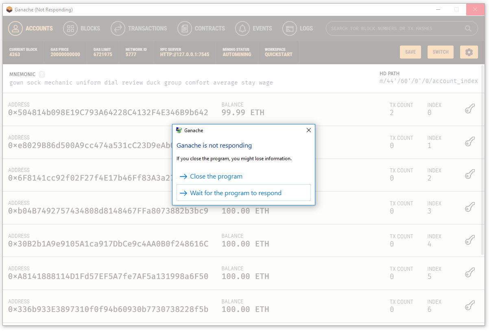

# Summary
This is a test repository intended to illustrate some bugs in Ganache, and may be used for load testing other Ethereum clients with appropriate adaptation.

  ## Steps to reproduce:
1. Install Truffle (`npm i truffle -g`).  You don't need drizzle and may have a narrower potential issue scope (better) without it.
This was developed with Truffle v5.0.4 (core: 5.0.4), Solidity v0.5.0 (solc-js), Node v9.3.0, and Windows 10 Pro.
2. Install Ganache.  Open it with default settings.
3. Clone this repo and navigate to it in your shell.
4. In migrations/3_many_transactions.js, there are two key parameters: transactionsToRun, and overwrite.  In initial testing noted below, these are set to 3000 and true, respectively.  A higher number is more likely to demonstrate issues, but takes longer to run.  Using "true" for the boolean parameter means a relatively constant (actually logarithmic) storage requirement for storing the *current state* of on-chain data. Change values at this step if desired.
5. Run `truffle migrate --reset` in this repo's directory.
6. You will see the migration files 1_initial_migration.js and 2_deploy_contracts.js complete successfully.
7. The TX COUNT for the first account and block count go up to 2, and stay there for a moment, reflecting the contract deployments.
8. The phrase "Transactions have all been started" appears in the console.
9. Several seconds pass. Ganache is still holding at current block = 2 = first account TX COUNT.
10. The block number starts to increase rapidly.  The first account's "TX COUNT" holds steady at 2, and its balance at 99.99 ETH.
11. The block number reaches 3002.  The first account's "TX COUNT" jumps to 3002 and its balance jumps down to 97.97 ETH.
12. Minutes pass.  The screen looks like this:

13. The console prints "All transactions completed; 3000/3000 without connection error.  Total cost: 0 ETH"
## Actual results
14. At about the same time as step 13, Ganche sometimes becomes a complete white-screen:

15. Ganache never recovers, even if allowed to sit for days.  Further attempts to issue transactions (e.g. rerun `truffle migrate --reset`) result in a "Could not connect to your Ethereum client" error.  You must close and restart Ganache.

The experiments above were done with Ganache 1.3.0 and transactionsToRun = 3000, closing and reopening Ganche before each.  
The first one led to success, and finished with 97.96 ETH. The second produced failure.
The third sat at step 12 for 2min 32 sec and produced success, finishing at 97.97 ETH, but was not responding on RPC.
On the fourth try, step 12 took 3min 2 sec, finished at 97.97 ETH, and Ganache was still responsive.  Changing the transaction count to 300 and rerunning `truffle migrate --reset` worked, twice, demonstrating continued responsiveness on RPC.
On try 5 (back up at 3K transactions), only about 1min 45 seconds went by before the command line reported success, but Ganache was a white-screen and not responsive on RPC.  
On try 6, I noticed it took about 1:34 to get the block number up to 3002, and another 3:35 to report transaction success.  The interface remained responsive but Ganache was not responsive on RPC, and attempting `truffle migrate --reset` caused the interface to go white-screen.  

### Ganache 2.0.0-beta2
I then installed Ganache-2.0.0-beta.2.  
I disabled analytics in case that was slowing anything down, and chose quickstart.    
It worked twice with transactionsToRun = 3000.   
I set transactionsToRun = 5000, and noticed the "current block" number get jumpy after 3000, e.g. pausing somewhere in the 3400s and then jumping suddenly to 3912, with "TX COUNT" stuck at 3877, then both numbers jumped to 5002.  The exact details of where the sticking points were, how long the increment paused there, and how far it jumped after changed from run to run.  Sometimes, when the block count appears stuck for several seconds at a particular number, the "TX COUNT" does not update, even after stopping at several different values.
The migration reported a total cost of 0.0087475 ETH for the second migration, and the third exited without reporting any completion or success message. The ending balance of the first account was generally 95.19 ETH, with TX COUNT = 5002.    
Ganache was then not responsive on RPC.    
Attempting to close Ganache produced "Ganache is not responding" error, and required force close.   
I observed this four times (run #s 1, 3, 4, 5 of 10).

Following run #s 2, 6, and 7, the UI was still responsive.  
In run 2, I did not test RPC and closed Ganche via the X button, which worked normally.  

After run 6 I temporarily changed transactionsToRun to 500 and attempted another `truffle migrate --reset` but Ganache was not responsive on RPC and the UI became nonresponsive (screenshot below) after the failed RPC call to replace the Migrations contract.   After restarting Ganache I verified that running the code with transactionsToRun = 500 works fine, and Ganache can close normally; I did not count this as a run.

After run 7, I made the same temporary change and again ran `truffle migrate --reset`.  The UI remained responsive (to clicking Settings, then Cancel), but there was no output from `truffle migrate --reset` (not even a "could not connect" error on replacing Migrations, or a return suggesting process termination), and no increase in the block number or TX COUNT, for at least an hour and 45 minutes, at which point I hit the X button to close Ganache and CTRL+C to stop the migration. The script was verified NOT paused to allow selection in the shell window.  On restarting Ganche and choosing Quickstart, I got an error that "The port is used by another application; please change it."  I used the X to close Ganache, CTRL+C to stop the migration, and opened Task Manager, to find four background Ganache processes listed, one of them using 17% of CPU power and 354.1MB of memory; the others using no CPU and <80MB of memory (two >70MB, one at 18.8MB).  

I closed these, reopened Ganache, and did run #8. I noticed five processes under the Ganache app, while it was running, consistent with later runs.   I also noticed the block number getting stuck at 4363 for several minutes, and then clicking on the interface produced the gray overlay for nonresponding applications; clicking the X showed this:
  
I closed the program and verified it was gone via Task Manager. I noted that the migration had returned without success or failure as with the most common case, described above.

Runs #9-10 repeated the behavior of run #6.  The "could not connect" failure took just under one minute in run 9, and just under 2 in run 10. Force-closing left no background processes.  For consistency, I re-ran the 502-transaction verification as described.

## Expected Results
- The expected result is that after step 13, Ganache remains a usable interface.  Clicking on Settings should bring you to settings, and then clicking Cancel should bring you back.   
- If Ganache is overwhelmed by too many requests, complete nonresponse and the "Could not connect" error seem appropriate.  However, once Ganche has caught up, it should resume responding to RPC requests.
- Account balances and tx counts should be accurate, or if they are inaccurate, have some visual indication saying they are inaccurate at that moment.  The indicator flag could be set by a new transaction coming in and cleared when the display is updated to the present.
- The sum of migration "total cost" reports should equal the difference in account balance before - after the migration.

## Issues Illustrated
 - Ganache hangs when there are too many outstanding transactions.  Once sufficiently overwhelmed, it does not appear to recover.
 - How many transactions counts as too many is not deterministic.
 - The "TX COUNT" and "BALANCE" fields do not necessarily reflect the accurate TX COUNT or balance as of the block shown in "Current Block." There is no support to help the user develop an accurate mental model of whether or not the displayed information is accurate or not, or when there's an update.  
 - The bottom-line "total cost" output from Truffle Migrate is incorrect, showing 0 when the actual amount of ETH used in a migration was multiple complete ETH.
